# Docker Application Screenshots Documentation

## 1. Our Application Screenshots

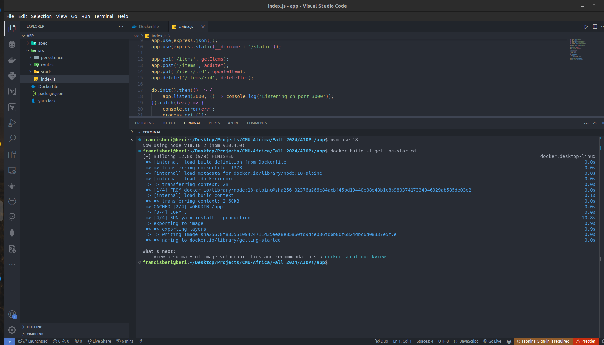

## 2. Updating Our Application Screenshots

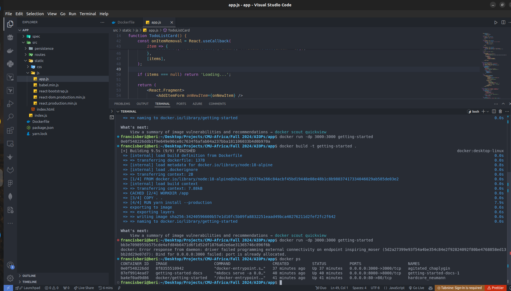

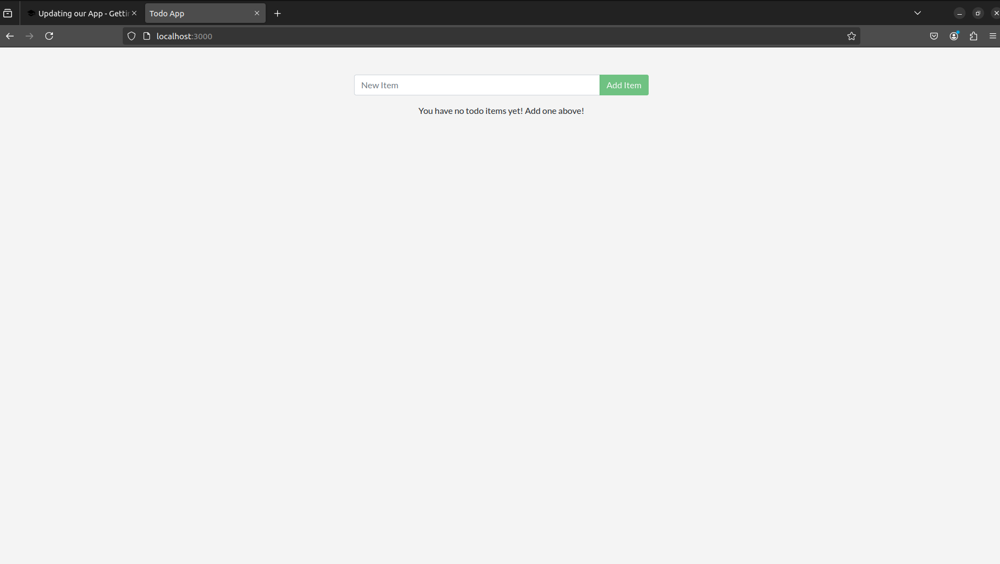

## 3. Sharing Our Application Screenshots

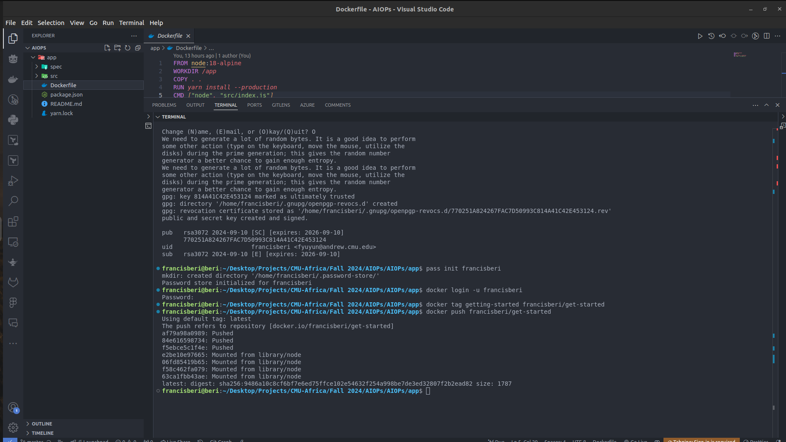

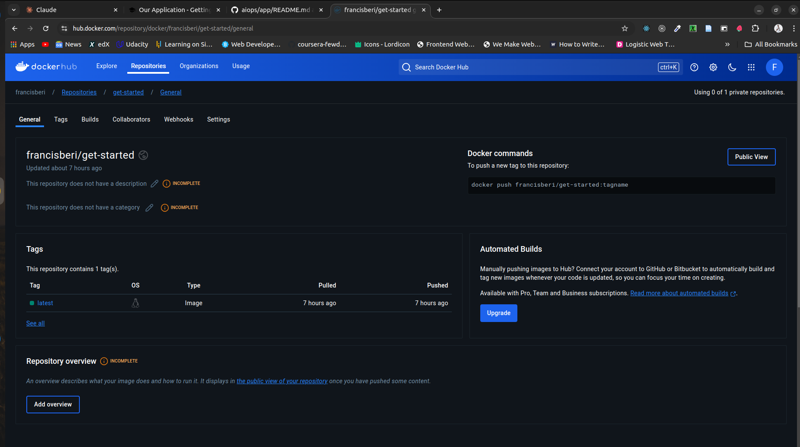

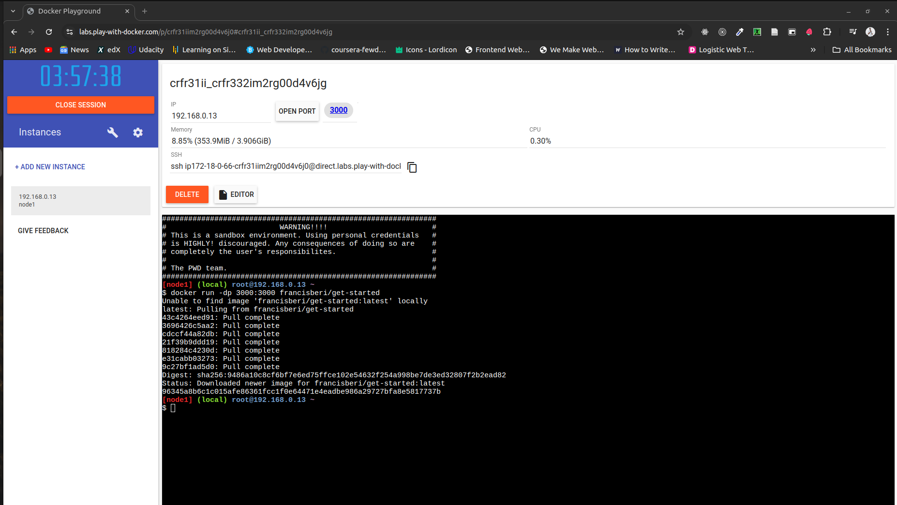

## 4. Persisting Our DB Screenshots

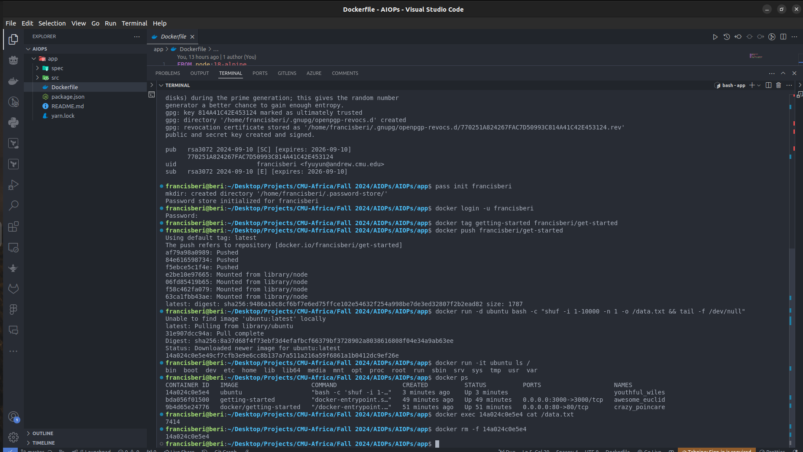

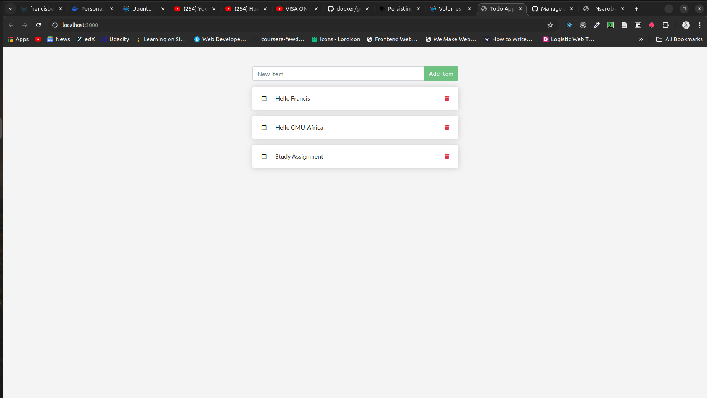

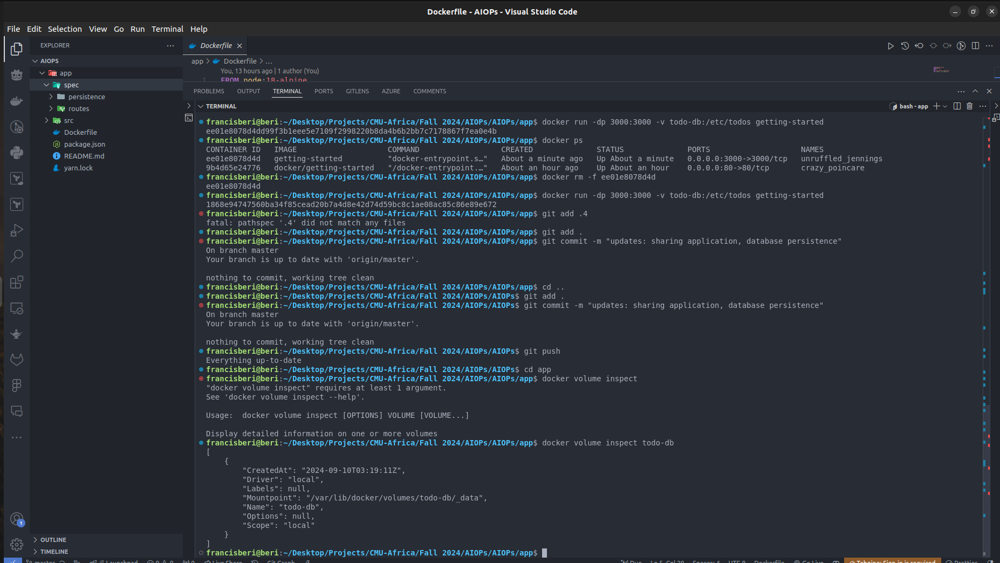

## 5. Using Bind Mounts Screenshots

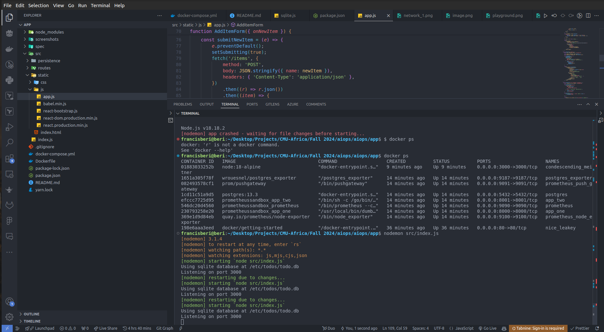

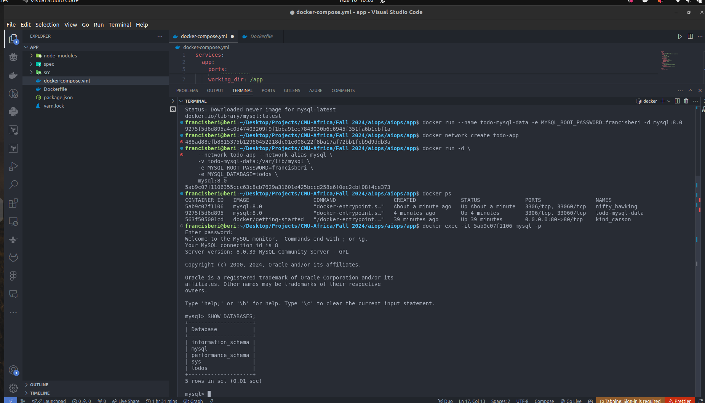

## 6. Using Docker Compose Screenshots

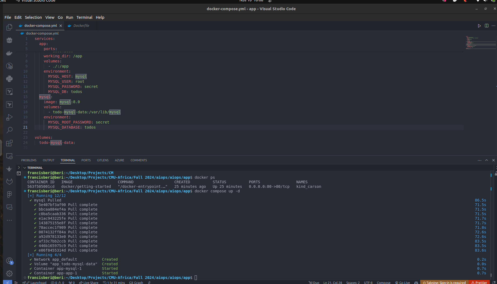

## 7. Custom Network Screenshots

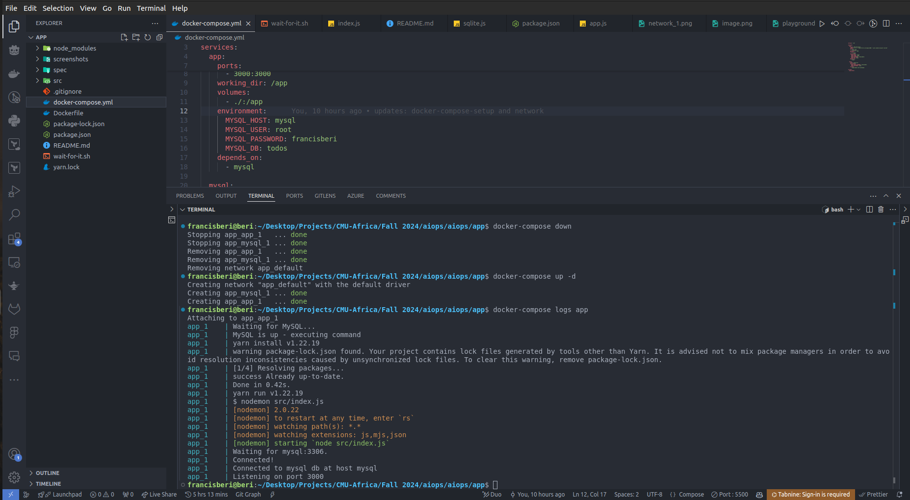

<!--  -->

## 8. Remote in to running container screenshots

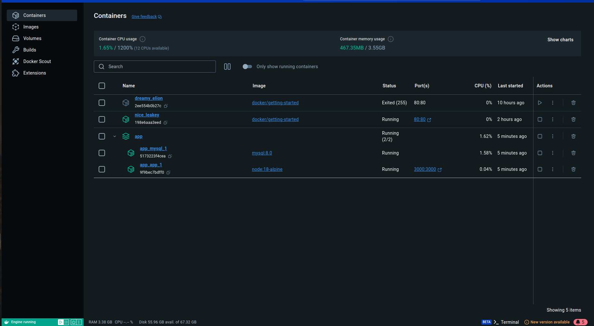
