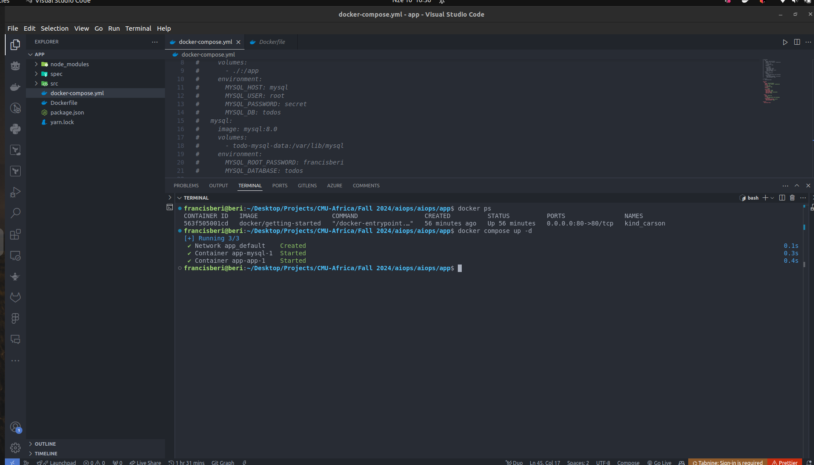

# Docker Application Screenshots Documentation

## 1. Our Application Screenshots

## 2. Updating Our Application Screenshots

## 3. Sharing Our Application Screenshots

## 4. Persisting Our DB Screenshots

## 5. Using Bind Mounts Screenshots

## 6. Using Docker Compose Screenshots

## 7. Custom Network Screenshots

<!--  -->

## 8. Remote in to running container screenshots

