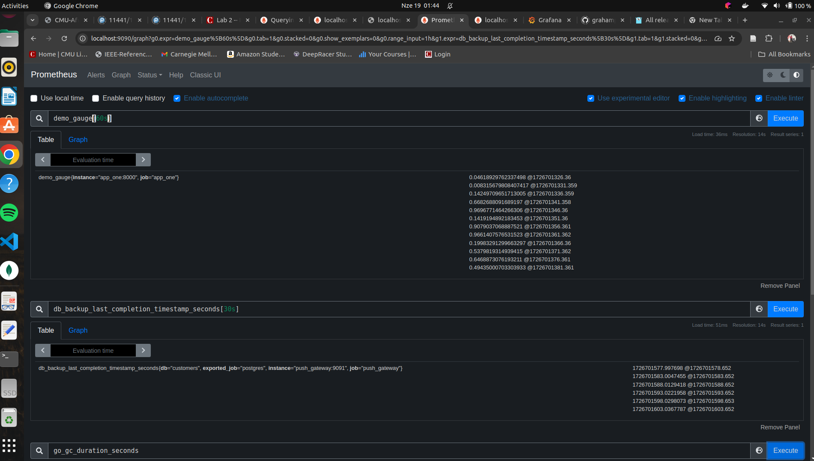
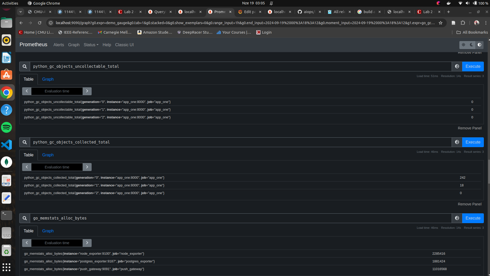
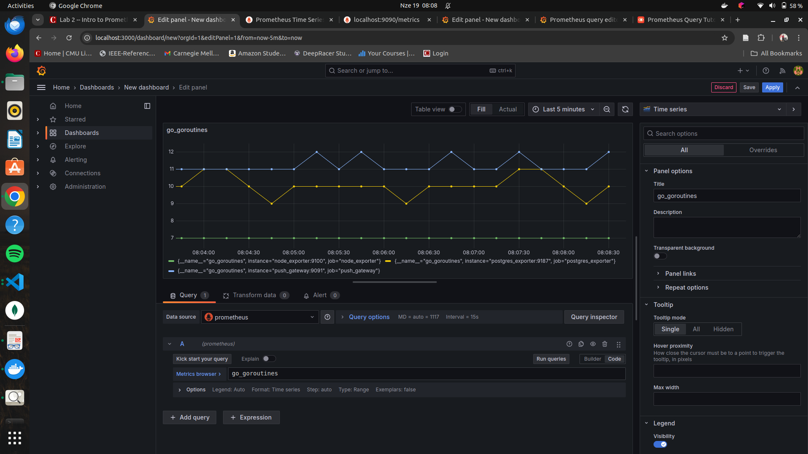
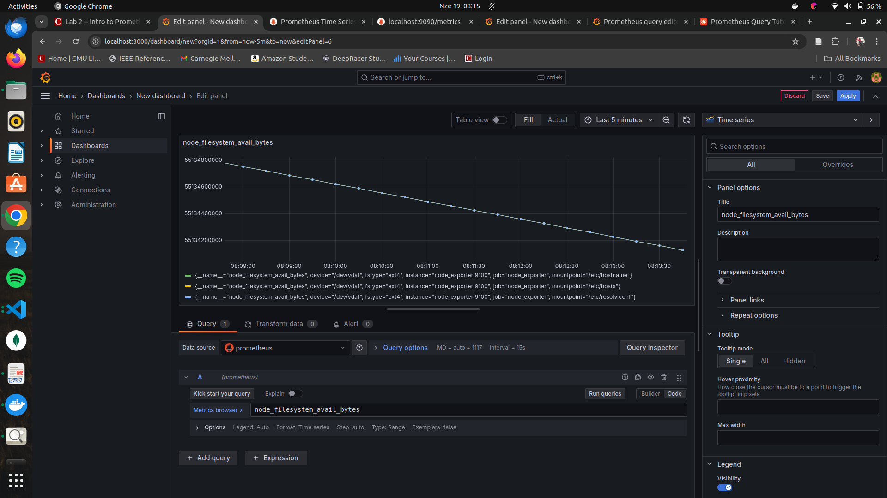

## 1. Prometheus queries

### Screen shots of the Prometheus display of these metrics

## Grafana dashboard for OOTB metrics

### Screen shots of the Grafa display of these metrics

## 3. Grafana dashboard for 4 new metrics

### Screen shots of the Grafa display of new metrics

# 4. Explanation of images, containers, docker-compose, and network

## Docker Images

Docker images are like blueprints for a software. They contain everything needed to run an app, including code, libraries, and settings.

**In our cureent project:** We use images for services like `node_exporter`, `push_gateway`, `postgres`, and `postgres_exporter`. For example, `node_exporter` uses the image `quay.io/prometheus/node-exporter`.

## Docker Containers

Containers are running versions of Docker images. They're like lightweight, isolated mini-computers that share the main computer's core.

**In our current project:** Each service in our `docker-compose.yml` file runs in its own container. For instance, `app_one` runs in a container built from its own Dockerfile.

## Docker-Compose

Docker-Compose helps run multiple Docker containers together. It uses a YAML file to set up all the parts of an application.

**In our current project:** Our `docker-compose.yml` file sets up several services:

- `app_one` and `app_two`
- `prometheus` and `grafana` for monitoring
- `node_exporter` and `push_gateway` for metrics
- `postgres` and `postgres_exporter` for database operations

Each service has its own settings, like which image to use and which ports to open.

## Network

In Docker, a network lets containers talk to each other. It's like a virtual network cable connecting different parts of your app.

**In our container project:** Docker-Compose automatically creates a network for our services. This lets them communicate with each other. For example, `app_two` can send data to `push_gateway` using `DOCKER_NETWORK: push_gateway:9091`.
