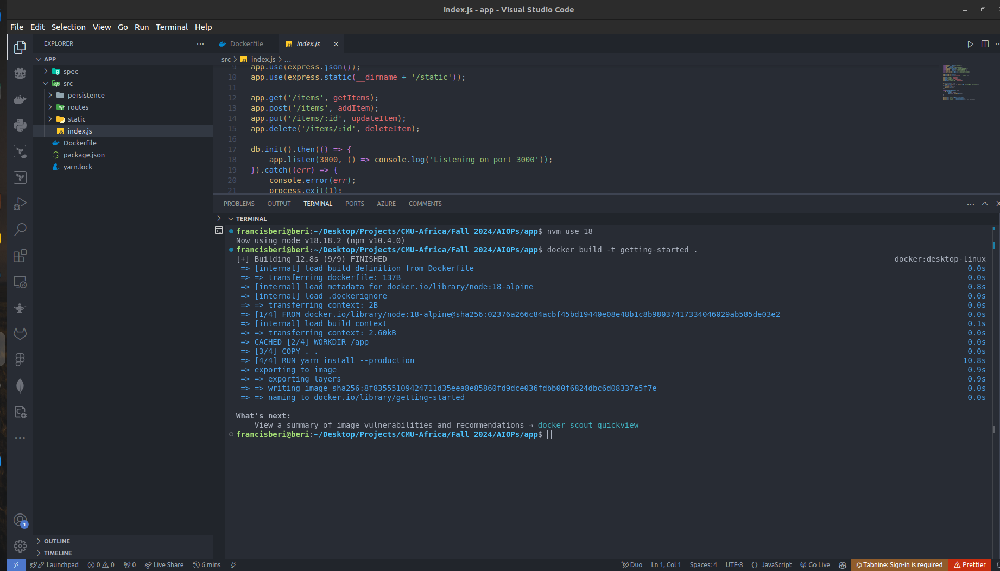
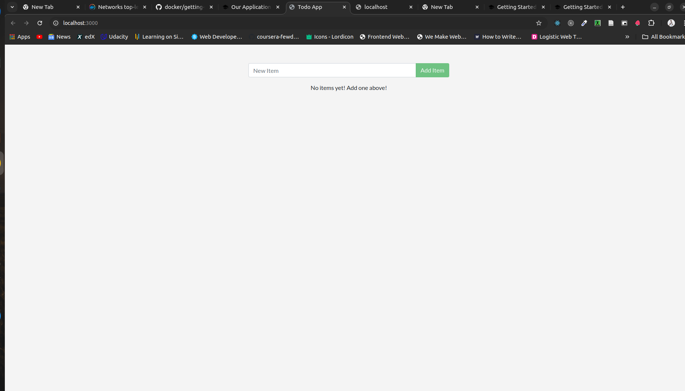

# Docker Application Screenshots Documentation

## 1. Our Application Screenshots

## 2. Updating Our Application Screenshots

[Insert screenshot of updating your application here]

## 3. Sharing Our Application Screenshots

[Insert screenshot of sharing your application here]

## 4. Persisting Our DB Screenshots

[Insert screenshot of persisting your database here]

## 5. Using Bind Mounts Screenshots

[Insert screenshot of using bind mounts here]

## 6. Using Docker Compose Screenshots

[Insert screenshot of using Docker Compose here]

## 7. Custom Network Screenshots

[Insert screenshot of custom network configuration here]

## 8. Remote in to Running Container Screenshots

[Insert screenshot of remoting into a running container here]